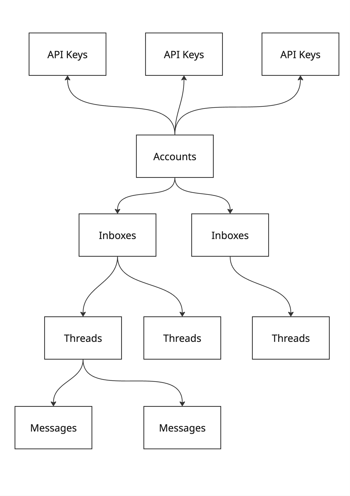

# Robomail

Programmatic email infra for agents. Create inboxes, send messages, and manage threads via a simple HTTP API.

## Installation
```
npm install robomail-sdk@latest
```

## Quickstart

```ts
import { RoboMailClient } from "robomail-sdk";

const client = new RoboMailClient({ token: process.env.ROBOMAIL_API_KEY });

// Create an inbox
const inbox = await client.inboxes.createInbox({
  username: "agent",
  domain: "example.org",
});

// Send a message
const message = await client.messages.sendMessage({
  inbox_email_address: "agent@example.org",
  to: "user@gmail.com",
  subject: "Hello from your agent",
  text: "Hi! How can I help you today?",
});

// Reply in the same thread
await client.messages.sendMessage({
  inbox_email_address: "agent@example.org",
  to: "user@gmail.com",
  in_reply_to_thread_id: message.thread_id,
  text: "Just following up!",
});

// List threads
const { threads } = await client.threads.listThreads({
  inbox_email_address: "agent@example.org",
});

// Register a webhook to receive incoming message events
const endpoint = await client.webhooks.createWebhookEndpoint({
  url: "https://myapp.example.com/webhooks/robomail",
  subscribed_events: ["message.received"],
});
// Store endpoint.signing_secret — used to verify incoming requests
```

## Caveat
- **Only Domain** that currently works with RoboMail is a spare domain from a past project `connectmecybersecurity.org`

## Stack

- **API** — Hono on Node.js
- **Database** — NeonDB (Postgres) via Drizzle ORM
- **Inbound email** — Resend webhook
- **Outbound email** — Resend
- **SDK** — Auto-generated via Fern from `openapi.yaml`

## Database

We leverage NeonDB to store information including registered accounts, their corresponding API Keys, inboxes, along with any threads, messages pertaining to each inbox.

## Schema



<!-- 


**accounts**
- `id` — UUID, PK
- `name` — TEXT NOT NULL
- `created_at` — TIMESTAMPTZ NOT NULL DEFAULT now()

**api_keys**
- `id` — UUID, PK
- `account_id` — UUID NOT NULL → accounts(id) CASCADE
- `name` — TEXT NOT NULL
- `prefix` — TEXT NOT NULL
- `hashed_key` — TEXT NOT NULL UNIQUE
- `created_at` — TIMESTAMPTZ NOT NULL DEFAULT now()

**inboxes**
- `id` — TEXT, PK
- `account_id` — UUID NOT NULL → accounts(id) CASCADE
- `address` — CITEXT NOT NULL UNIQUE
- `display_name` — TEXT
- `metadata` — JSONB NOT NULL DEFAULT `{}`
- `created_at` — TIMESTAMPTZ NOT NULL DEFAULT now()

**threads**
- `id` — TEXT, PK
- `inbox_id` — TEXT NOT NULL → inboxes(id) CASCADE
- `account_id` — UUID NOT NULL → accounts(id) CASCADE
- `subject` — TEXT
- `root_message_id_header` — TEXT NOT NULL
- `last_message_at` — TIMESTAMPTZ
- `created_at` — TIMESTAMPTZ NOT NULL DEFAULT now()

**messages**
- `id` — TEXT, PK
- `thread_id` — TEXT NOT NULL → threads(id) CASCADE
- `inbox_id` — TEXT NOT NULL → inboxes(id) CASCADE
- `account_id` — UUID NOT NULL → accounts(id) CASCADE
- `direction` — TEXT NOT NULL CHECK (`inbound` | `outbound`)
- `status` — TEXT NOT NULL DEFAULT `sent` CHECK (`queued` | `sent` | `delivered` | `bounced` | `received`)
- `message_id_header` — TEXT NOT NULL
- `in_reply_to` — TEXT
- `from_address` — CITEXT NOT NULL
- `to_addresses` — CITEXT[] NOT NULL DEFAULT `{}`
- `cc_addresses` — CITEXT[] NOT NULL DEFAULT `{}`
- `bcc_addresses` — CITEXT[] NOT NULL DEFAULT `{}`
- `subject` — TEXT
- `body_text` — TEXT
- `body_html` — TEXT
- `headers` — JSONB NOT NULL DEFAULT `{}`
- `raw` — TEXT
- `embedding` — VECTOR(384)
- `created_at` — TIMESTAMPTZ NOT NULL DEFAULT now()

**webhook_endpoints**
- `id` — UUID, PK
- `account_id` — UUID NOT NULL → accounts(id) CASCADE
- `url` — TEXT NOT NULL
- `description` — TEXT
- `subscribed_events` — TEXT[]
- `signing_secret` — TEXT NOT NULL
- `is_enabled` — BOOLEAN NOT NULL DEFAULT true
- `created_at` — TIMESTAMPTZ NOT NULL DEFAULT now() -->

## Sending and Receiving Emails
Resend provides a practical and convenient service to enable RoboMail to send outbound emails. As for inbound emails, when an email address with a configured domain receives an email, Resend makes a POST request to our API server with the message payload, enabling us to process and store it. Resend also sends delivery status callbacks (`email.delivered`, `email.bounced`) for outbound messages, which update the message status in the database. 

## Webhooks

Register an HTTPS endpoint to receive real-time event notifications. Supported events are `thread.created`, `message.received`, `message.delivered`, and `message.bounced`. Endpoints can be scoped to a specific inbox with `inbox_id` and filtered to a subset of events with `subscribed_events`.

```ts
// Register an endpoint
const endpoint = await client.webhooks.createWebhookEndpoint({
  url: "https://myapp.example.com/webhooks/robomail",
  inbox_id: "agent@example.org",                          // optional: scope to one inbox
  subscribed_events: ["message.received", "thread.created"], // optional: defaults to all
});
const signingSecret = endpoint.signing_secret; // store securely — only returned once

```

## SDK releases

```bash
git tag vx.x.x && git push --tags
```

Pushing a tag triggers CI to regenerate and publish the SDK to npm via Fern.
